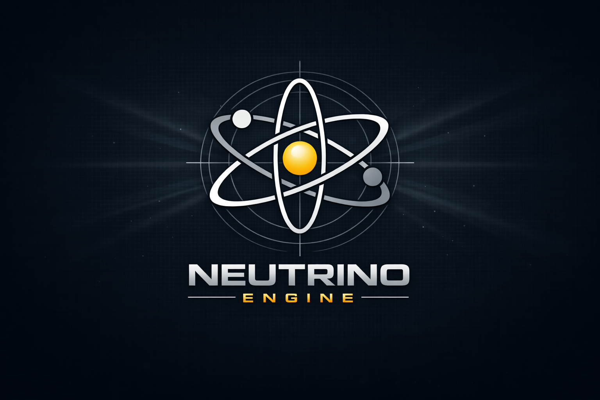

# Neutrino



**Neutrino** is a Real-Time Rendering and Compute Engine based on **Vulkan** and **C++**.

## Building Neutrino

### Windows (example for Visual Studio 2022)

```
cmake -B build -G "Visual Studio 17 2022"
cmake --build build --config Release
```

### Windows (example for Visual Studio 2026)

```
cmake -B build -G "Visual Studio 18 2026"
cmake --build build --config Release
```

### Linux (Unix makefiles)

```
cmake -B build -DCMAKE_BUILD_TYPE=Release
cmake --build build
```

